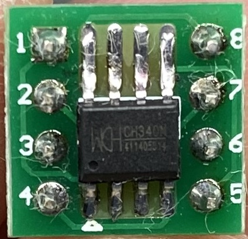

# CH340N

[](img/ch340n.JPG)

The **CH340N** is a USB bus converter chip which converts USB to serial port or USB to printer port.

This chip is a small smd 8-pin version from the **CH340** family of USB to serial port chips.

The small form and internal crystal make this a very attractive DIY solution as a very low part count is required.

```
  CH340N
        _____
  UD+ 1|*    |8 V3
  UD- 2|     |7 RXD
  GND 3|     |6 TXD
  RTS 4|_____|5 VCC
```

In my testing version I used only 5 very common extra parts.

Parts Used:
  - 1x CH340N (8-pin)
  - 3x 100nf cap
  - 2x 1k resistors

You can get away with just 2x 100nf capacitors but there is no protection and it is wise to add the 2x resistors in series to the data pins and a 100nf capacitor in series with the *Reset* and *RTS* pins.


## Notes

The CH340C, CH340E and CH340B versions have a built-in clock generator, no external crystal required.

See http://wch-ic.com/products/CH340.html.

### Links
- https://www.aliexpress.com/item/1005005933363878.html?spm=a2g0o.store_pc_allItems_or_groupList.new_all_items_2007586669962.1005005933363878
- https://www.eevblog.com/forum/projects/ch340-oscillator-question/
- https://wch-ic.com/products/CH340.html


